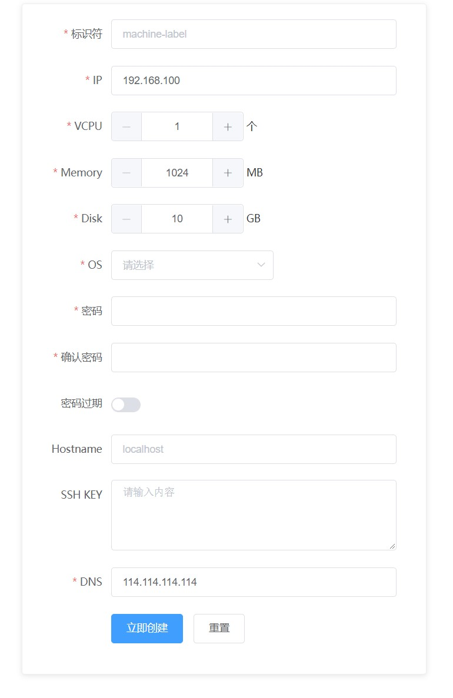

# nocloud-cloudy
本程序用于在单台服务器上设置KVM虚拟机, 通过网页界面方便的设置参数并启动虚拟机。


# First step: prepare your server
1. Ubuntu
```
# Ubuntu
1. sudo apt install qemu-kvm libvirt-bin bridge-utils virt-manager virtinst virt-viewer genisoimage
2. vim /etc/network/interfaces # 配置网卡为桥接网络，桥接网卡名设为为br0, 然后重启网络
3. 找一个目标文件夹比如：/kvm/,创建子目录cloud-images, metadata, vms
4. 下载ubuntu和centos的云镜相，放入cloud-images目录中，分别改名为ubuntu.base.img, centos.base.img。下载链接为
centos 7: http://mirrors.ustc.edu.cn/centos-cloud/centos/7/images/CentOS-7-x86_64-GenericCloud.qcow2
ubuntu 16.04: http://mirrors.ustc.edu.cn/ubuntu-cloud-images/xenial/current/xenial-server-cloudimg-amd64-disk1.img
5. Done
```

2. CentOS
```
# CentOS
1. sudo yum install qemu-kvm libvirt virt-install bridge-utils virt-manager genisoimage
2. vim /etc/sysconfig/network-scripts/ifcfg-br0
3. vim /etc/sysconfig/network-scripts/ifcfg-eth0(也可能叫其它名字)
4. 找一个目标文件夹比如：/kvm/,创建子目录cloud-images, metadata, vms
5. 下载ubuntu和centos的云镜相，放入cloud-images目录中，分别改名为ubuntu.base.img, centos.base.img
下载链接为
    centos 7: http://mirrors.ustc.edu.cn/centos-cloud/centos/7/images/CentOS-7-x86_64-GenericCloud.qcow2
    ubuntu 16.04: http://mirrors.ustc.edu.cn/ubuntu-cloud-images/xenial/current/xenial-server-cloudimg-amd64-disk1.img
6. Done
```

# Config
```
更改system/settings.py里面的信息，主要更改的有BASE_URL, NETWORK_ID, DEBUG
默认的DEBUG设为True，这时网页POST的数据并不会真的运行，只会在后台打印命令，可以先把这些命令运行一下，看是否能够成功开启虚拟机，
如果可以，把DEBUG设为False， 重新运行python run.py，就可以直接从网页上创建虚拟机了
```

# Setup Web Server
```
git clone <this repo>
cd nocloud-cloudy
pip install -r requirements.txt
sudo python run.py  # 需要用root权限，或者将当前用户添加到libvirtd组中
```

# Useage
```
Visit http://<your-ip>:8888
``` 

# ISSUES
```
ubuntu的cloud镜相默认的网卡为ens3
centos的cloud镜像默认的网卡为eth0
如果你的镜像不是这样，那么请修改settings中的INTERFACE_MAP
```

#screenshot
